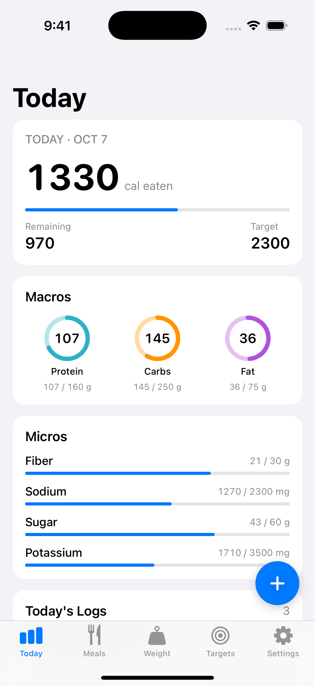
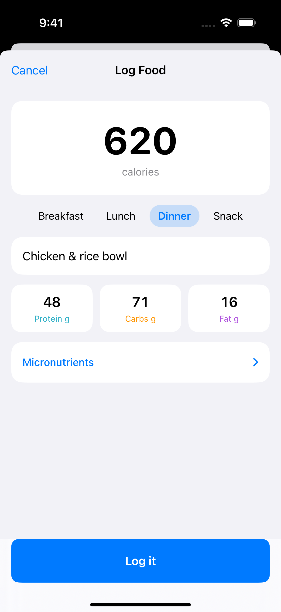
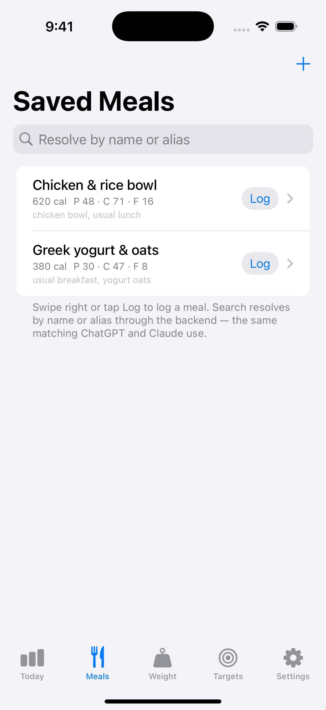
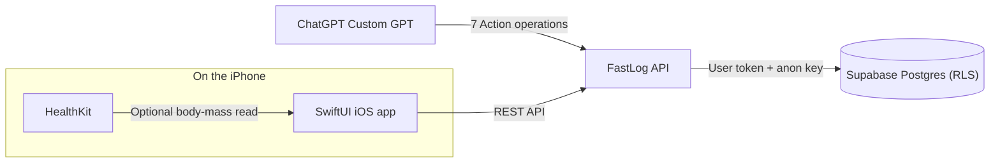

# FastLog

FastLog gives people who already estimate macros with ChatGPT a fast, trustworthy place to log those numbers. It is not a food database.

[](https://github.com/jacobwolf-1/FastLog/actions/workflows/ci.yml)
[](LICENSE)


## Screenshots

| Dashboard | Manual log | Saved meals |
| --- | --- | --- |
|  |  |  |

## How it works

With a breakfast template saved under the alias “usual breakfast”:

1. **Ask ChatGPT:** “Log my usual breakfast, 1.5 servings.”
2. **Resolve the meal:** the Action asks the backend to find the saved template by name or alias.
3. **Log the numbers:** the backend copies the stored macros, scales them by 1.5, and stamps the food log `source=chatgpt` on the ChatGPT-facing deployment.
4. **See the result:** opening or refreshing the iPhone's Today dashboard loads the updated totals and food log.
5. **Trace the write:** the same backend request also records an `ai_audit_log` row with the provider, operation, and user.

If no confident match exists, the assistant asks whether to estimate and log a one-off entry. It must not silently invent a saved meal.

## What I built

- **Postgres schema with row-level security:** user-owned targets, food logs, saved meals and aliases, weight entries, and AI audit records.
- **REST API with memory and Supabase stores:** local demos and tests use memory; the Supabase store passes user tokens through to Postgres for ownership enforcement.
- **ChatGPT Action limited to seven operations:** `logFood`, `getTodayDashboard`, `updateTargets`, `resolveSavedMeal`, `logSavedMeal`, `createSavedMeal`, and `listSavedMeals`.
- **SwiftUI iPhone app with optional HealthKit:** dashboard, manual logging, saved meals, targets, and weight trends; body-mass reading stays on-device.
- **Integration and AI-path test suites:** dashboard calculations, saved-meal history, serving multipliers, spoofed provenance fields, and AI audit records.

## Architecture



HealthKit access happens locally. The user can prefill a weight entry from Apple Health and save it to FastLog; the app does not write back to Apple Health.

## Design decisions

- **No food database.** FastLog focuses on logging and daily totals; users supply nutrition values themselves or estimate them with an assistant.
- **A narrow AI operation set.** Seven operations cover the core logging workflow and reduce the actions an assistant can take; deletes, broad edits, weight operations, and date-range reads stay outside the Action.
- **Server-derived provenance and audit records.** The backend ignores client-supplied `source` and `provider`, making AI writes attributable; this requires a trusted deployment context for the ChatGPT path.
- **Backend-only saved-meal resolution.** The assistant logs a resolved template's stored macros instead of inventing a saved meal; uncertain matches require a follow-up rather than a guessed template.

## Quickstart

Requires **Node 22+**. Run locally with no database or credentials:

```sh
git clone https://github.com/jacobwolf-1/FastLog.git
cd FastLog
npm run dev          # in-memory mode, listening on http://localhost:8787
```

In another terminal:

```sh
# read current targets (null for a fresh user)
curl -s http://localhost:8787/v1/targets/current \
  -H 'Authorization: Bearer dev:user-a:user-a@example.test'

# log a one-off entry
curl -s -X POST http://localhost:8787/v1/food-logs \
  -H 'Authorization: Bearer dev:user-a:user-a@example.test' \
  -H 'Content-Type: application/json' \
  -d '{"calories":500,"protein_g":40,"carbs_g":45,"fat_g":15,"label":"lunch"}'
```

In memory mode only, auth uses `Bearer dev:<user-id>[:email]`. For the iPhone app, follow the [iOS developer-mode setup](ios/README.md#local-development-developer-mode).

## See the AI write path yourself

The executable smoke test runs the Action routes in memory, with no hosting, ChatGPT account, or credentials:

```sh
npm run test:ai-action
```

It checks saved-meal resolution, 1.5× logging, one-off logging, target updates, server-derived `source`/`provider` (including ignored spoofed values), and AI audit rows.

Run the integration suite for dashboard math, saved-meal edits and alias cascades, historical-log preservation, and user-isolation assumptions:

```sh
npm test
```

For an interactive walkthrough, follow the [local AI demo](docs/local-ai-demo.md).

## Status / not yet done

- Production OAuth/account linking for the GPT is designed but not implemented. The [private Action smoke test](docs/chatgpt-action-smoke-test.md) uses a temporary user token.
- A real Supabase `db reset` has not been run; live migration and RLS verification remain outstanding.
- The iOS app uses a minimal GoTrue client for Supabase Auth, rather than the supabase-swift SDK.

## Deploying

To use a Supabase project, run the API on a Node host behind HTTPS:

```sh
FASTLOG_STORE=supabase \
SUPABASE_URL='https://your-project.supabase.co' \
SUPABASE_ANON_KEY='your-anon-or-publishable-key' \
npm start
```

The API uses user bearer tokens and the anon key so RLS enforces ownership; it does not require a service-role key. Set `FASTLOG_INTEGRATION_PROVIDER=chatgpt` on the ChatGPT-facing deployment to derive provenance server-side. Keep default/manual traffic on a deployment without that setting.

See [ChatGPT Action setup](docs/chatgpt-action-setup.md) for configuration and authentication requirements.

## Documentation

- [Product summary](docs/PRODUCT_PLAN.md)
- [Full API reference](docs/api.md)
- [AI behavior](docs/ai-behavior.md) and [saved-meal resolution](docs/saved-meal-resolution.md)
- [iOS setup](ios/README.md)
- [Test plan](docs/test-plan.md)

## License

MIT — see [LICENSE](LICENSE).
